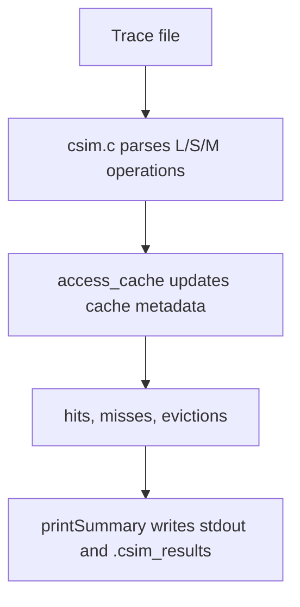
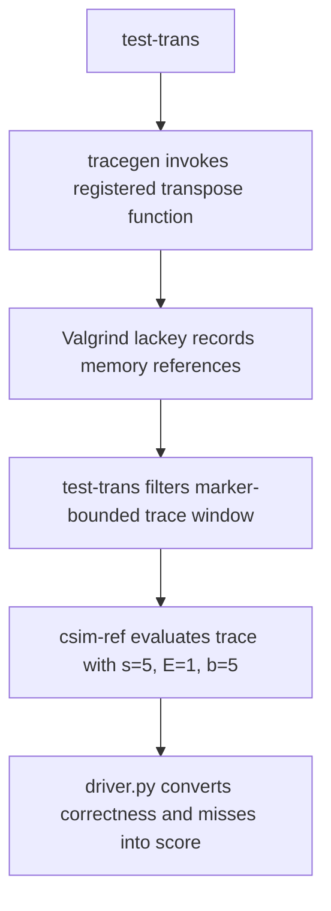
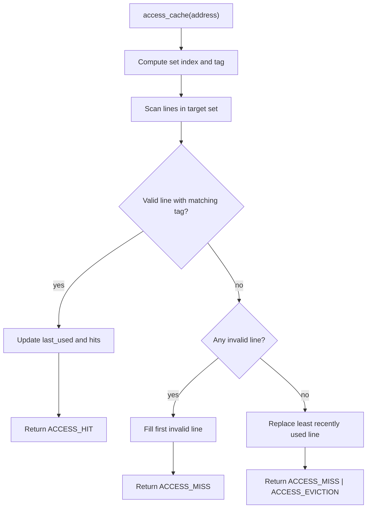
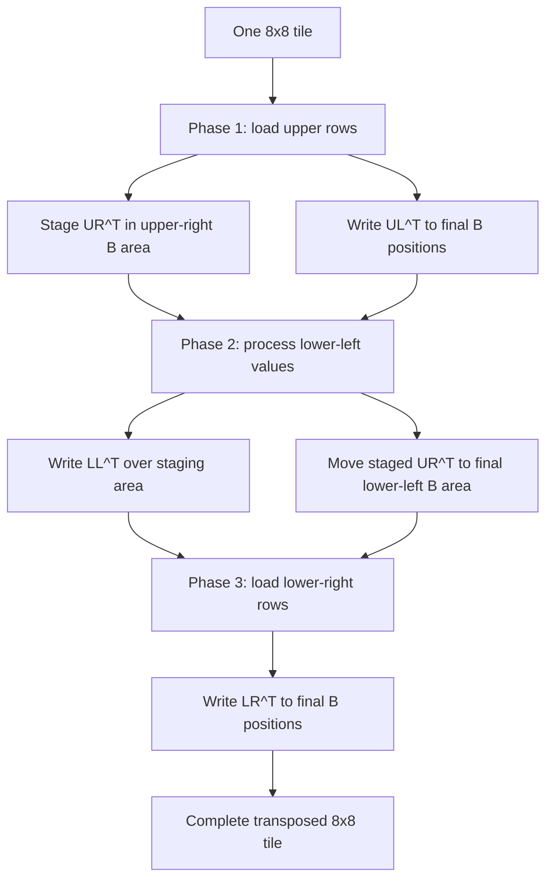

# Technical Design Document

This document is a comprehensive technical design guide for this Cache Lab repository. It explains the implementation as it exists in the current codebase, with the source files as the source of truth:

- [csim.c](../csim.c): configurable cache simulator
- [trans.c](../trans.c): cache-aware matrix transpose implementation
- [cachelab.c](../cachelab.c) and [cachelab.h](../cachelab.h): grading helper interfaces
- [test-trans.c](../test-trans.c), [tracegen.c](../tracegen.c), and [driver.py](../driver.py): evaluation harness
- [Makefile](../Makefile): build rules

The project has two independent but related parts:

1. A simulator that models cache hits, misses, and evictions for Valgrind-style traces.
2. A matrix transpose implementation tuned for the direct-mapped cache model used by the lab driver.

The key design theme across both parts is that the code does not simulate or optimize more than the grading model needs. The simulator stores only line metadata, because hit/miss behavior depends only on validity, tags, and replacement order. The transpose code uses explicit scalar movement and fixed tile schedules, because the benchmark rewards controlling cache-line residency and avoiding direct-mapped conflicts.

## Reader Guide

This is a code-level design document, not a quick-start guide. For a shorter project overview, use [README.md](../README.md). For implementation review, read this document in this order:

1. **High-Level Architecture** for the runtime flow.
2. **Shared Cache Model** for the cache geometry used by both parts.
3. **Part A: Cache Simulator Design** for `csim.c` internals.
4. **Part B: Matrix Transpose Design** for `trans.c` internals.
5. **Evaluation Harness Design** for how the driver measures correctness and misses.
6. **Correctness Contracts** and **Review Checklist** before modifying code.

The recorded performance numbers in this document come from the project's existing documented Linux validation results. The current macOS workspace can run the locally built `csim` binary directly, but the original `test-csim`, `csim-ref`, and full transpose performance path require a Linux-compatible environment and, for transpose, Valgrind.

## High-Level Architecture

The repository is small, but the runtime flow has several moving pieces. The simulator path is direct: parse a trace, update cache metadata, and report the final counters.



The transpose path is more involved because the driver measures memory references rather than wall-clock time.



The optimized submission entry point is `transpose_submit` in [trans.c](../trans.c). It dispatches by matrix size:

```c
void transpose_submit(int M, int N, int A[N][M], int B[M][N])
{
    if (M == 32 && N == 32) {
        transpose_32(M, N, A, B);
    } else if (M == 64 && N == 64) {
        transpose_64(M, N, A, B);
    } else {
        transpose_generic(M, N, A, B);
    }
}
```

That dispatch matches the three graded transpose workloads:

- `32x32`
- `64x64`
- `61x67`

There is no named `transpose_61x67` function. The irregular workload is handled by the generic blocked helper.

## Repository Map

| Path | Role |
| --- | --- |
| [csim.c](../csim.c) | Student cache simulator for Part A |
| [trans.c](../trans.c) | Student transpose implementation for Part B |
| [cachelab.c](../cachelab.c) | Shared helper implementation used by simulator and transpose tests |
| [cachelab.h](../cachelab.h) | Shared type declarations and helper prototypes |
| [driver.py](../driver.py) | Original Python 2 grading driver |
| [test-trans.c](../test-trans.c) | Transpose correctness and performance harness |
| [tracegen.c](../tracegen.c) | Invokes transpose functions under Valgrind trace generation |
| [test-csim](../test-csim) | Prebuilt simulator checker |
| [csim-ref](../csim-ref) | Prebuilt reference simulator used by transpose evaluation |
| [traces/](../traces) | Simulator trace inputs |
| [Makefile](../Makefile) | Build and cleanup rules |

## Build And Platform Model

The original assignment tooling assumes Linux `x86_64`. The repository currently contains a locally built `csim` executable for macOS arm64, while `test-csim` and `csim-ref` are Linux ELF binaries. That means:

- `./csim` can be run directly in the current macOS workspace.
- `./test-csim`, `./csim-ref`, and the full original driver need a Linux-compatible environment.
- The official transpose performance path also needs `valgrind`.

The Makefile builds the C sources with strict warnings:

```make
CC = gcc
CFLAGS = -g -Wall -Werror -std=c99 -m64

all: csim test-trans tracegen
	# Generate a handin tar file each time you compile
	-tar -cvf ${USER}-handin.tar  csim.c trans.c
```

The key build targets are:

```make
csim: csim.c cachelab.c cachelab.h
	$(CC) $(CFLAGS) -o csim csim.c cachelab.c -lm

test-trans: test-trans.c trans.o cachelab.c cachelab.h
	$(CC) $(CFLAGS) -o test-trans test-trans.c cachelab.c trans.o

tracegen: tracegen.c trans.o cachelab.c
	$(CC) $(CFLAGS) -O0 -o tracegen tracegen.c trans.o cachelab.c
```

The `trans.o` target is compiled with `-O0`:

```make
trans.o: trans.c
	$(CC) $(CFLAGS) -O0 -c trans.c
```

That matters for the transpose benchmark. The measured memory trace should reflect the written code instead of an aggressively transformed compiler output.

## Shared Cache Model

The simulator and transpose benchmark both use the standard cache-lab address model:

```text
address bits:

| tag | set index | block offset |
```

For a cache with `s` set-index bits, `E` lines per set, and `b` block-offset bits:

```text
number of sets = 2^s
block size     = 2^b bytes
set index      = (address >> b) & ((1 << s) - 1)
tag            = address >> (s + b)
```

The transpose grading cache is fixed by [test-trans.c](../test-trans.c):

```c
eval_perf(5, 1, 5);
```

So Part B is evaluated with:

```text
s = 5                 -> 32 sets
E = 1                 -> direct-mapped cache
b = 5                 -> 32-byte blocks
cache capacity        -> 32 sets * 1 line/set * 32 bytes = 1024 bytes
sizeof(int)           -> 4 bytes
ints per cache block  -> 32 / 4 = 8 ints
```

The `8 ints per cache block` fact explains almost every transpose decision in [trans.c](../trans.c):

- `32x32` uses `8x8` tiles.
- `64x64` uses `8x8` tiles but splits each tile into `4x4` quadrants to avoid conflict misses.
- The generic path uses larger clipped tiles because irregular dimensions make clean boundary handling more important than exact quadrant choreography.

## Part A: Cache Simulator Design

File: [csim.c](../csim.c)

The simulator implements the Cache Lab command-line contract:

```text
Usage: ./csim [-hv] -s <num> -E <num> -b <num> -t <file>

-h         print help
-v         verbose trace output
-s <num>   number of set index bits
-E <num>   lines per set
-b <num>   number of block offset bits
-t <file>  trace file
```

It models only data-memory operations:

- `I`: instruction fetch, ignored
- `L`: load, one cache access
- `S`: store, one cache access
- `M`: modify, two cache accesses, equivalent to load then store

The simulator does not need to model bytes inside a block. For hit/miss/eviction counts, each line needs only:

- a valid bit
- a tag
- an LRU timestamp

### Simulator Data Structures

[csim.c](../csim.c) defines three internal structures:

```c
typedef struct {
    int valid;
    unsigned long long tag;
    unsigned long long last_used;
} CacheLine;

typedef struct {
    CacheLine *lines;
} CacheSet;

typedef struct {
    CacheSet *sets;
    int s;
    int E;
    int b;
    unsigned long long set_mask;
    unsigned long long timestamp;
    int hits;
    int misses;
    int evictions;
} Cache;
```

This is an explicit set-associative cache:

```text
Cache
  sets[0]
    lines[0..E-1]
  sets[1]
    lines[0..E-1]
  ...
  sets[(1 << s) - 1]
    lines[0..E-1]
```

The implementation keeps the following invariants after successful initialization:

```text
cache.sets != NULL
number of sets == 1ULL << cache.s
each set owns exactly cache.E CacheLine entries
cache.timestamp starts at 0 and increases once per data access
cache.hits, cache.misses, and cache.evictions start at 0
```

For each line:

```text
valid == 0:
    tag and last_used are ignored

valid == 1:
    tag identifies the resident memory block
    last_used is the timestamp of the most recent access to that line
```

### Argument Parsing

The CLI parser uses `getopt` and a dedicated numeric parser:

```c
static int parse_int_arg(const char *text, int allow_zero, int *value)
{
    long parsed;
    char *endptr;

    if (text == NULL || *text == '\0') {
        return 0;
    }

    errno = 0;
    parsed = strtol(text, &endptr, 10);
    if (errno != 0 || *endptr != '\0') {
        return 0;
    }
    if (parsed < 0 || parsed > INT_MAX) {
        return 0;
    }
    if (!allow_zero && parsed == 0) {
        return 0;
    }

    *value = (int)parsed;
    return 1;
}
```

The parser rejects:

- null or empty text
- non-decimal suffixes such as `12x`
- values that overflow `int`
- negative values
- zero when the caller does not allow zero

The option loop delegates validation to that helper:

```c
while ((opt = getopt(argc, argv, "hvs:E:b:t:")) != -1) {
    switch (opt) {
    case 'h':
        print_usage(argv[0]);
        return 0;
    case 'v':
        verbose = 1;
        break;
    case 's':
        if (!parse_int_arg(optarg, 1, &s)) {
            print_usage(argv[0]);
            return 1;
        }
        have_s = 1;
        break;
    case 'E':
        if (!parse_int_arg(optarg, 0, &E)) {
            print_usage(argv[0]);
            return 1;
        }
        have_E = 1;
        break;
    case 'b':
        if (!parse_int_arg(optarg, 1, &b)) {
            print_usage(argv[0]);
            return 1;
        }
        have_b = 1;
        break;
    case 't':
        trace_path = optarg;
        break;
    default:
        print_usage(argv[0]);
        return 1;
    }
}
```

Two details are intentional:

- `E` must be positive, because a cache set with zero lines cannot be accessed safely.
- `s` and `b` may be zero, because a one-set cache or one-byte block is still a meaningful model.

After option parsing, the code verifies that all required options are present and that address shifts are safe:

```c
if (!have_s || !have_E || !have_b || trace_path == NULL) {
    print_usage(argv[0]);
    return 1;
}
if (s >= addr_bits || b >= addr_bits || s + b >= addr_bits) {
    print_usage(argv[0]);
    return 1;
}
```

This prevents undefined behavior from shifts at or beyond the width of `unsigned long long`.

### Cache Allocation

`init_cache` initializes the metadata fields and allocates a two-level cache:

```c
static int init_cache(Cache *cache, int s, int E, int b)
{
    unsigned long long set_count;
    unsigned long long set_index;

    cache->sets = NULL;
    cache->s = s;
    cache->E = E;
    cache->b = b;
    cache->set_mask = (s == 0) ? 0ULL : ((1ULL << s) - 1ULL);
    cache->timestamp = 0ULL;
    cache->hits = 0;
    cache->misses = 0;
    cache->evictions = 0;

    set_count = 1ULL << s;
    cache->sets = (CacheSet *)calloc((size_t)set_count, sizeof(CacheSet));
    if (cache->sets == NULL) {
        return 0;
    }
```

Each set receives its own line array:

```c
    for (set_index = 0; set_index < set_count; ++set_index) {
        cache->sets[set_index].lines = (CacheLine *)calloc((size_t)E, sizeof(CacheLine));
        if (cache->sets[set_index].lines == NULL) {
            unsigned long long cleanup_index;
            for (cleanup_index = 0; cleanup_index < set_index; ++cleanup_index) {
                free(cache->sets[cleanup_index].lines);
            }
            free(cache->sets);
            cache->sets = NULL;
            return 0;
        }
    }

    return 1;
}
```

Using `calloc` gives every `valid` field an initial value of zero. The explicit cleanup path prevents leaks if allocation fails partway through.

The matching deallocator is symmetrical:

```c
static void free_cache(Cache *cache)
{
    unsigned long long set_count;
    unsigned long long set_index;

    if (cache->sets == NULL) {
        return;
    }

    set_count = 1ULL << cache->s;
    for (set_index = 0; set_index < set_count; ++set_index) {
        free(cache->sets[set_index].lines);
    }
    free(cache->sets);
    cache->sets = NULL;
}
```

The `cache->sets == NULL` guard makes cleanup safe on failure paths.

### Address Decomposition

The simulator precomputes `set_mask` once:

```c
cache->set_mask = (s == 0) ? 0ULL : ((1ULL << s) - 1ULL);
```

Then each access extracts the set index and tag:

```c
set_index = (address >> cache->b) & cache->set_mask;
tag = address >> (cache->s + cache->b);
```

Example with `s = 4`, `E = 1`, `b = 4`:

```text
address    = 0x10
set_mask   = 0xf
set_index  = (0x10 >> 4) & 0xf = 1
tag        = 0x10 >> 8 = 0

address    = 0x110
set_index  = (0x110 >> 4) & 0xf = 1
tag        = 0x110 >> 8 = 1
```

Those two addresses map to the same set but have different tags. In a direct-mapped cache, the second access evicts the first if the first is still resident.

### Access Result Flags

`access_cache` returns a bitmask that describes the outcome:

```c
enum {
    ACCESS_HIT = 1,
    ACCESS_MISS = 2,
    ACCESS_EVICTION = 4
};
```

The valid return values are:

```text
ACCESS_HIT                         -> hit
ACCESS_MISS                        -> miss
ACCESS_MISS | ACCESS_EVICTION      -> miss eviction
```

There is no legal `ACCESS_HIT | ACCESS_EVICTION` result. Eviction is only possible after a miss in a full set.

### LRU Strategy

LRU is implemented with a single monotonic timestamp:

```c
cache->timestamp += 1ULL;
```

On a hit, the matching line receives the current timestamp:

```c
if (line->tag == tag) {
    line->last_used = cache->timestamp;
    cache->hits += 1;
    return ACCESS_HIT;
}
```

On a miss into a full set, the line with the smallest `last_used` value is evicted.

This strategy is simple and appropriate here:

- no linked lists
- no line reordering
- no aging pass
- access time remains `O(E)`
- replacement behavior is easy to audit

### Core Access Algorithm

`access_cache` performs one pass over the target set:



```c
static int access_cache(Cache *cache, unsigned long long address)
{
    unsigned long long set_index;
    unsigned long long tag;
    CacheSet *set;
    CacheLine *empty_line;
    CacheLine *lru_line;
    int line_index;

    cache->timestamp += 1ULL;
    set_index = (address >> cache->b) & cache->set_mask;
    tag = address >> (cache->s + cache->b);
    set = &cache->sets[set_index];
    empty_line = NULL;
    lru_line = NULL;
```

During the scan, the function tracks three possibilities:

```c
    for (line_index = 0; line_index < cache->E; ++line_index) {
        CacheLine *line = &set->lines[line_index];

        if (line->valid) {
            if (line->tag == tag) {
                line->last_used = cache->timestamp;
                cache->hits += 1;
                return ACCESS_HIT;
            }
            if (lru_line == NULL || line->last_used < lru_line->last_used) {
                lru_line = line;
            }
        } else if (empty_line == NULL) {
            empty_line = line;
        }
    }
```

The three tracked outcomes are:

```text
tag match      -> hit, return immediately
invalid line   -> remember first empty line
valid nonmatch -> update least-recently-used candidate
```

If the scan finishes without a hit, the access is a miss:

```c
    cache->misses += 1;
    if (empty_line != NULL) {
        empty_line->valid = 1;
        empty_line->tag = tag;
        empty_line->last_used = cache->timestamp;
        return ACCESS_MISS;
    }

    lru_line->tag = tag;
    lru_line->last_used = cache->timestamp;
    cache->evictions += 1;
    return ACCESS_MISS | ACCESS_EVICTION;
}
```

The miss behavior is:

1. Fill the first empty line if one exists.
2. Otherwise overwrite the least recently used line.
3. Count an eviction only in the overwrite case.

That gives the key counter invariant:

```text
hits + misses == number of data accesses simulated
evictions <= misses
```

### Trace Parsing

The trace loop reads line by line:

```c
while (fgets(buffer, (int)sizeof(buffer), trace_file) != NULL) {
    char op;
    unsigned long long address;
    int size;

    if (sscanf(buffer, " %c %llx,%d", &op, &address, &size) != 3) {
        continue;
    }
    if (op == 'I') {
        continue;
    }
```

The leading space in the format string allows either leading-space Valgrind lines or no-leading-space lines:

```c
" %c %llx,%d"
```

For verbose mode, the original operation is printed before the result tokens:

```c
    if (verbose) {
        printf("%c %llx,%d", op, address, size);
    }
```

Then the operation dispatch applies the Cache Lab semantics:

```c
    if (op == 'L' || op == 'S') {
        int result = access_cache(&cache, address);
        if (verbose) {
            print_result_tokens(result);
            printf("\n");
        }
    } else if (op == 'M') {
        int first = access_cache(&cache, address);
        int second = access_cache(&cache, address);
        if (verbose) {
            print_result_tokens(first);
            print_result_tokens(second);
            printf("\n");
        }
    }
}
```

For `M`, the second access should always hit because the first access either already hit or loaded the block:

```text
M address,size
    first access:  hit OR miss OR miss eviction
    second access: hit
```

### Verbose Output Formatting

The verbose printer orders tokens to match the expected reference style:

```c
static void print_result_tokens(int result)
{
    if ((result & ACCESS_MISS) != 0) {
        printf(" miss");
    }
    if ((result & ACCESS_EVICTION) != 0) {
        printf(" eviction");
    }
    if ((result & ACCESS_HIT) != 0) {
        printf(" hit");
    }
}
```

A cold modify that does not evict prints:

```text
M 20,1 miss hit
```

A modify that misses, evicts, then hits prints:

```text
M 12,1 miss eviction hit
```

### Example Trace Walkthrough

[traces/yi.trace](../traces/yi.trace) contains:

```text
 L 10,1
 M 20,1
 L 22,1
 S 18,1
 L 110,1
 L 210,1
 M 12,1
```

With `s = 4`, `E = 1`, `b = 4`, the current simulator prints:

```text
L 10,1 miss
M 20,1 miss hit
L 22,1 hit
S 18,1 hit
L 110,1 miss eviction
L 210,1 miss eviction
M 12,1 miss eviction hit
hits:4 misses:5 evictions:3
```

The final summary comes from `printSummary`:

```c
void printSummary(int hits, int misses, int evictions)
{
    printf("hits:%d misses:%d evictions:%d\n", hits, misses, evictions);
    FILE* output_fp = fopen(".csim_results", "w");
    assert(output_fp);
    fprintf(output_fp, "%d %d %d\n", hits, misses, evictions);
    fclose(output_fp);
}
```

That helper both prints to stdout and writes `.csim_results`, which the grading tools consume.

### Error Handling And Cleanup

The simulator handles allocation failure:

```c
if (!init_cache(&cache, s, E, b)) {
    fprintf(stderr, "Failed to allocate cache\n");
    return 1;
}
```

It also handles trace-open failure and releases already allocated cache memory:

```c
trace_file = fopen(trace_path, "r");
if (trace_file == NULL) {
    fprintf(stderr, "%s: %s\n", trace_path, strerror(errno));
    free_cache(&cache);
    return 1;
}
```

The success path closes the file, reports results, and frees the cache:

```c
fclose(trace_file);
printSummary(cache.hits, cache.misses, cache.evictions);
free_cache(&cache);
return 0;
```

### Simulator Complexity

Let:

```text
S = 2^s sets
E = lines per set
T = number of data accesses in the trace after ignoring I operations
```

Then:

```text
memory complexity:        O(S * E)
time per access:          O(E)
total trace processing:   O(T * E)
```

This is expected for a direct explicit set-associative simulator. Because Cache Lab traces use small `E`, the one-pass set scan is simpler than a more complex replacement data structure.

### Simulator Design Review

The simulator is intentionally compact, but it has the important robustness properties:

- 64-bit addresses are parsed with `%llx`.
- shift widths are validated before cache initialization.
- invalid numeric arguments are rejected instead of silently accepted.
- partial allocation failure is cleaned up.
- LRU behavior is deterministic.
- `M` operations are implemented as two ordinary accesses.
- verbose mode prints result tokens in reference-compatible order.

The main limitation is that unknown non-`I`, non-`L`, non-`S`, non-`M` parsed operations are silently ignored after optional operation printing has already occurred. The provided traces do not contain such operations, so this does not affect the grading workload.

## Part B: Matrix Transpose Design

File: [trans.c](../trans.c)

The transpose function must implement:

```c
void trans(int M, int N, int A[N][M], int B[M][N]);
```

The required result is:

```text
B[col][row] == A[row][col]
```

The implementation is evaluated on a direct-mapped `1KB` cache with `32-byte` blocks. The code is written to respect typical Cache Lab constraints:

- no heap allocation in the transpose functions
- no recursion
- no local arrays inside the optimized transpose path
- scalar temporaries only
- straightforward control flow that the trace generator can measure cleanly

### Function Map

| Function | Role |
| --- | --- |
| `transpose_submit` | Graded entry point, dispatches by matrix dimensions |
| `transpose_32` | Specialized `32x32` implementation using `8x8` tiles |
| `transpose_64` | Specialized `64x64` implementation using staged `8x8` tiles split into `4x4` quadrants |
| `transpose_generic` | Bounded `16x16` blocked traversal for all other dimensions |
| `trans` | Simple baseline implementation registered for comparison |
| `registerFunctions` | Registers both the optimized and baseline functions with the test harness |
| `is_transpose` | Correctness checker helper |

The registration function is:

```c
void registerFunctions()
{
    registerTransFunction(transpose_submit, transpose_submit_desc);
    registerTransFunction(trans, trans_desc);
}
```

The grading harness identifies the official solution by description string:

```c
#define SUBMIT_DESCRIPTION "Transpose submission"
```

That is why [trans.c](../trans.c) preserves:

```c
char transpose_submit_desc[] = "Transpose submission";
```

### Row-Major Address Math

C stores `int A[N][M]` in row-major order. The element address formulas are:

```c
address(A[r][c]) = base_A + sizeof(int) * (r * M + c);
address(B[c][r]) = base_B + sizeof(int) * (c * N + r);
```

For the transpose grading cache:

```c
set_index = (address >> 5) & 31;
```

Contiguous source-row reads are cache friendly:

```c
A[k][j + 0];
A[k][j + 1];
A[k][j + 2];
A[k][j + 3];
A[k][j + 4];
A[k][j + 5];
A[k][j + 6];
A[k][j + 7];
```

Those eight `int` values occupy exactly one `32-byte` cache block.

The corresponding writes are transposed:

```c
B[j + 0][k] = a0;
B[j + 1][k] = a1;
B[j + 2][k] = a2;
B[j + 3][k] = a3;
B[j + 4][k] = a4;
B[j + 5][k] = a5;
B[j + 6][k] = a6;
B[j + 7][k] = a7;
```

Those writes touch different rows of `B`. The transpose implementations are therefore organized around preserving source locality while controlling the order of destination writes.

## `32x32` Transpose

The `32x32` path uses `8x8` blocking:

```c
static void transpose_32(int M, int N, int A[N][M], int B[M][N])
{
    int i, j, k;
    int a0, a1, a2, a3, a4, a5, a6, a7;

    for (i = 0; i < N; i += 8) {
        for (j = 0; j < M; j += 8) {
            for (k = i; k < i + 8; ++k) {
                a0 = A[k][j];
                a1 = A[k][j + 1];
                a2 = A[k][j + 2];
                a3 = A[k][j + 3];
                a4 = A[k][j + 4];
                a5 = A[k][j + 5];
                a6 = A[k][j + 6];
                a7 = A[k][j + 7];
```

The loaded row is written into the transposed destination positions:

```c
                B[j][k] = a0;
                B[j + 1][k] = a1;
                B[j + 2][k] = a2;
                B[j + 3][k] = a3;
                B[j + 4][k] = a4;
                B[j + 5][k] = a5;
                B[j + 6][k] = a6;
                B[j + 7][k] = a7;
            }
        }
    }
}
```

The tile behavior is:

```text
for each 8x8 tile:
    for each row k in the tile:
        read A[k][j..j+7] into scalar temporaries
        write the eight values to B[j..j+7][k]
```

The code uses scalar temporaries for a practical reason:

```text
load the complete source cache block first
then perform destination writes
```

Without the scalar staging, destination writes could evict source data before all eight values were consumed.

The correctness invariant for each row inside a tile is:

```c
B[j + 0][k] == A[k][j + 0];
B[j + 1][k] == A[k][j + 1];
B[j + 2][k] == A[k][j + 2];
B[j + 3][k] == A[k][j + 3];
B[j + 4][k] == A[k][j + 4];
B[j + 5][k] == A[k][j + 5];
B[j + 6][k] == A[k][j + 6];
B[j + 7][k] == A[k][j + 7];
```

Because `32` is divisible by `8`, there is no boundary handling in this helper. The loops cover exactly:

```text
row tiles: 0, 8, 16, 24
col tiles: 0, 8, 16, 24
```

The recorded result for this implementation is:

```text
32x32 transpose: 287 misses
```

The driver awards full performance credit at or below `300` misses for this case.

## `64x64` Transpose

The `64x64` path is the most important part of [trans.c](../trans.c). A simple `8x8` strategy works well for `32x32`, but it performs poorly on `64x64` because direct-mapped set conflicts become much more frequent.

The implementation still uses `8x8` tiles, but it splits each tile into four `4x4` quadrants:

```text
Source tile A[i..i+7][j..j+7]

              j..j+3       j+4..j+7
            +-----------+-----------+
i..i+3      |    UL     |    UR     |
            |   4 x 4   |   4 x 4   |
            +-----------+-----------+
i+4..i+7    |    LL     |    LR     |
            |   4 x 4   |   4 x 4   |
            +-----------+-----------+
```

The final destination tile in `B` must contain:

```text
Destination tile B[j..j+7][i..i+7]

              i..i+3       i+4..i+7
            +-----------+-----------+
j..j+3      |   UL^T    |   LL^T    |
            |   4 x 4   |   4 x 4   |
            +-----------+-----------+
j+4..j+7    |   UR^T    |   LR^T    |
            |   4 x 4   |   4 x 4   |
            +-----------+-----------+
```

The code reaches that final state in three phases.

### Phase 1: Load Upper Rows And Stage Upper-Right Data

The first loop handles the top four source rows:

```c
for (k = 0; k < 4; ++k) {
    a0 = A[i + k][j];
    a1 = A[i + k][j + 1];
    a2 = A[i + k][j + 2];
    a3 = A[i + k][j + 3];
    a4 = A[i + k][j + 4];
    a5 = A[i + k][j + 5];
    a6 = A[i + k][j + 6];
    a7 = A[i + k][j + 7];

    B[j][i + k] = a0;
    B[j + 1][i + k] = a1;
    B[j + 2][i + k] = a2;
    B[j + 3][i + k] = a3;
    B[j][i + k + 4] = a4;
    B[j + 1][i + k + 4] = a5;
    B[j + 2][i + k + 4] = a6;
    B[j + 3][i + k + 4] = a7;
}
```

The first four writes are final:

```c
B[j + 0][i + k] = A[i + k][j + 0];
B[j + 1][i + k] = A[i + k][j + 1];
B[j + 2][i + k] = A[i + k][j + 2];
B[j + 3][i + k] = A[i + k][j + 3];
```

The last four writes are staging writes:

```c
B[j + 0][i + k + 4] = A[i + k][j + 4];
B[j + 1][i + k + 4] = A[i + k][j + 5];
B[j + 2][i + k + 4] = A[i + k][j + 6];
B[j + 3][i + k + 4] = A[i + k][j + 7];
```

After phase 1, the tile in `B` looks like:

```text
              i..i+3       i+4..i+7
            +-----------+-----------+
j..j+3      |   UL^T    | UR^T temp |
            |   final   |  staged   |
            +-----------+-----------+
j+4..j+7    |  unused   |  unused   |
            +-----------+-----------+
```

The staging area is deliberate. It holds `UR^T` in rows `j..j+3` until the lower-left source values can be loaded and written efficiently.

### Phase 2: Swap Staged Upper-Right With Lower-Left

The second loop processes one left-column slice of the bottom half at a time:

```c
for (k = 0; k < 4; ++k) {
    a0 = B[j + k][i + 4];
    a1 = B[j + k][i + 5];
    a2 = B[j + k][i + 6];
    a3 = B[j + k][i + 7];

    a4 = A[i + 4][j + k];
    a5 = A[i + 5][j + k];
    a6 = A[i + 6][j + k];
    a7 = A[i + 7][j + k];
```

The first four loads recover the staged `UR^T` values from `B`. The next four loads read the `LL` values from `A`.

Then the code writes `LL^T` into the upper-right destination quadrant:

```c
    B[j + k][i + 4] = a4;
    B[j + k][i + 5] = a5;
    B[j + k][i + 6] = a6;
    B[j + k][i + 7] = a7;
```

Finally it moves the staged `UR^T` values into the lower-left destination quadrant:

```c
    B[j + 4 + k][i] = a0;
    B[j + 4 + k][i + 1] = a1;
    B[j + 4 + k][i + 2] = a2;
    B[j + 4 + k][i + 3] = a3;
}
```

After phase 2:

```text
              i..i+3       i+4..i+7
            +-----------+-----------+
j..j+3      |   UL^T    |   LL^T    |
            |   final   |   final   |
            +-----------+-----------+
j+4..j+7    |   UR^T    |  pending  |
            |   final   |           |
            +-----------+-----------+
```

The postconditions are:

```c
/* For k = 0..3 and q = 0..3. */
B[j + k][i + 4 + q] == A[i + 4 + q][j + k];
B[j + 4 + k][i + q] == A[i + q][j + 4 + k];
```

This is the central optimization. `B` is used as a temporary staging area so that the source tile can be consumed in an order that avoids the worst direct-mapped conflict pattern.

### Phase 3: Write Lower-Right Directly

The last loop handles the lower-right quadrant:

```c
for (k = 0; k < 4; ++k) {
    a0 = A[i + 4 + k][j + 4];
    a1 = A[i + 4 + k][j + 5];
    a2 = A[i + 4 + k][j + 6];
    a3 = A[i + 4 + k][j + 7];

    B[j + 4][i + 4 + k] = a0;
    B[j + 5][i + 4 + k] = a1;
    B[j + 6][i + 4 + k] = a2;
    B[j + 7][i + 4 + k] = a3;
}
```

After this, all four destination quadrants are final:

```text
              i..i+3       i+4..i+7
            +-----------+-----------+
j..j+3      |   UL^T    |   LL^T    |
            |   final   |   final   |
            +-----------+-----------+
j+4..j+7    |   UR^T    |   LR^T    |
            |   final   |   final   |
            +-----------+-----------+
```

The final postcondition is:

```c
/* For q = 0..3 and k = 0..3. */
B[j + 4 + q][i + 4 + k] == A[i + 4 + k][j + 4 + q];
```

### `64x64` Algorithm Summary

One `8x8` tile is processed as:



```text
phase 1:
    read top four rows of A
    write UL^T to final B positions
    stage UR^T in the upper-right area of B

phase 2:
    read staged UR^T back from B
    read LL from A
    write LL^T to final upper-right positions
    move staged UR^T to final lower-left positions

phase 3:
    read LR from A
    write LR^T to final lower-right positions
```

As compact pseudocode:

```text
for each 8x8 tile (i, j):
    for k in 0..3:
        load A top row: UL values and UR values
        write UL to final B
        stage UR in B

    for k in 0..3:
        load staged UR from B
        load LL column from A
        write LL to final B
        move UR to final B

    for k in 0..3:
        load LR row from A
        write LR to final B
```

The recorded result for this implementation is:

```text
64x64 transpose: 1227 misses
```

The driver awards full performance credit at or below `1300` misses. This is the strongest evidence that the code is doing more than ordinary blocking.

## Generic Transpose For Irregular Sizes

The generic helper handles all non-`32x32`, non-`64x64` inputs:

```c
static void transpose_generic(int M, int N, int A[N][M], int B[M][N])
{
    int i, j, k, l;

    for (i = 0; i < N; i += 16) {
        for (j = 0; j < M; j += 16) {
            for (k = i; k < N && k < i + 16; ++k) {
                for (l = j; l < M && l < j + 16; ++l) {
                    B[l][k] = A[k][l];
                }
            }
        }
    }
}
```

For the graded irregular case, `M = 61` and `N = 67`, so the loops cover:

```text
row starts: 0, 16, 32, 48, 64
col starts: 0, 16, 32, 48
```

The boundary conditions clip partial tiles:

```c
k < N && k < i + 16
l < M && l < j + 16
```

For the last row tile:

```text
i = 64
k = 64, 65, 66
```

For the last column tile:

```text
j = 48
l = 48..60
```

The helper never reads or writes outside the valid matrix bounds. Its implicit tile contract is:

```c
row_start = i;
row_end = min(i + 16, N);
col_start = j;
col_end = min(j + 16, M);

for (k = row_start; k < row_end; ++k) {
    for (l = col_start; l < col_end; ++l) {
        B[l][k] = A[k][l];
    }
}
```

The generic path is intentionally less intricate than the `64x64` path. Irregular dimensions are harder to choreograph perfectly, and the full-credit threshold is looser. A clean clipped-block traversal gives strong locality without adding fragile dimension-specific code.

The recorded result for this implementation is:

```text
61x67 transpose: 1992 misses
```

The driver awards full performance credit at or below `2000` misses.

## Baseline Transpose And Correctness Helper

[trans.c](../trans.c) keeps a simple transpose implementation for comparison:

```c
char trans_desc[] = "Simple row-wise scan transpose";
void trans(int M, int N, int A[N][M], int B[M][N])
{
    int i, j, tmp;

    for (i = 0; i < N; i++) {
        for (j = 0; j < M; j++) {
            tmp = A[i][j];
            B[j][i] = tmp;
        }
    }
}
```

This baseline is correct but not optimized. It exists so the test harness can report multiple registered functions.

The local correctness helper checks the transpose relation directly:

```c
int is_transpose(int M, int N, int A[N][M], int B[M][N])
{
    int i, j;

    for (i = 0; i < N; i++) {
        for (j = 0; j < M; ++j) {
            if (A[i][j] != B[j][i]) {
                return 0;
            }
        }
    }
    return 1;
}
```

The test harness uses its own validation path in [tracegen.c](../tracegen.c), but this helper documents the exact correctness property the optimized code must satisfy.

## Evaluation Harness Design

The Part B evaluation path is worth understanding because it explains why [trans.c](../trans.c) is written with explicit memory operations.

### Function Registration

[cachelab.h](../cachelab.h) defines the registration type:

```c
typedef struct trans_func{
  void (*func_ptr)(int M,int N,int[N][M],int[M][N]);
  char* description;
  char correct;
  unsigned int num_hits;
  unsigned int num_misses;
  unsigned int num_evictions;
} trans_func_t;
```

[cachelab.c](../cachelab.c) stores registered functions in a global array:

```c
trans_func_t func_list[MAX_TRANS_FUNCS];
int func_counter = 0;
```

Registration appends to that array:

```c
void registerTransFunction(void (*trans)(int M, int N, int[N][M], int[M][N]),
                           char* desc)
{
    func_list[func_counter].func_ptr = trans;
    func_list[func_counter].description = desc;
    func_list[func_counter].correct = 0;
    func_list[func_counter].num_hits = 0;
    func_list[func_counter].num_misses = 0;
    func_list[func_counter].num_evictions =0;
    func_counter++;
}
```

### Trace Generation

[tracegen.c](../tracegen.c) creates static matrices:

```c
static int A[256][256];
static int B[256][256];
static int M;
static int N;
```

It records marker addresses:

```c
volatile char MARKER_START, MARKER_END;
```

Before and after each transpose call, it touches those markers:

```c
MARKER_START = 33;
(*func_list[selectedFunc].func_ptr)(M, N, A, B);
MARKER_END = 34;
```

[test-trans.c](../test-trans.c) uses those marker addresses to isolate the trace region for the transpose function.

### Correctness Validation

The harness builds a known-correct result:

```c
int C[M][N];
memset(C,0,sizeof(C));
correctTrans(M,N,A,C);
```

Then it compares the candidate output:

```c
for(int i=0;i<M;i++) {
    for(int j=0;j<N;j++) {
        if(B[i][j]!=C[i][j]) {
            printf("Validation failed on function %d! Expected %d but got %d at B[%d][%d]\n",fn,C[i][j],B[i][j],i,j);
            return 0;
        }
    }
}
return 1;
```

This means performance is only meaningful if correctness passes first.

### Trace Filtering

[test-trans.c](../test-trans.c) runs Valgrind Lackey:

```c
sprintf(cmd, "valgrind --tool=lackey --trace-mem=yes --log-fd=1 -v ./tracegen -M %d -N %d -F %d  > trace.tmp", M, N,i);
```

Then it filters trace lines between marker accesses:

```c
if (addr == marker_start)
    flag = 1;

if (flag && addr < 0xffffffff) {
    fputs(buf, part_trace_fp);
}

if (addr == marker_end) {
    flag = 0;
    fclose(part_trace_fp);
    break;
}
```

The `addr < 0xffffffff` filter is the assignment's simple way to ignore many stack references emitted by Valgrind.

### Performance Measurement

The harness evaluates the filtered trace with the reference simulator:

```c
sprintf(cmd, "./csim-ref -s %u -E %u -b %u -t trace.f%d > /dev/null",
        s, E, b, i);
system(cmd);
```

Then it reads `.csim_results`:

```c
FILE* in_fp = fopen(".csim_results","r");
assert(in_fp);
fscanf(in_fp, "%u %u %u", &hits, &misses, &evictions);
fclose(in_fp);
```

This is why the transpose code is judged by memory-reference behavior rather than wall-clock time.

## Scoring Model

[driver.py](../driver.py) defines the maximum points:

```python
maxscore= {};
maxscore['csim'] = 27
maxscore['transc'] = 1
maxscore['trans32'] = 8
maxscore['trans64'] = 8
maxscore['trans61'] = 10
```

Miss scores are computed by linear interpolation:

```python
def computeMissScore(miss, lower, upper, full_score):
    if miss <= lower:
        return full_score
    if miss >= upper:
        return 0

    score = (miss - lower) * 1.0
    range = (upper- lower) * 1.0
    return round((1 - score / range) * full_score, 1)
```

The thresholds are:

```python
trans32_score = computeMissScore(miss32, 300, 600, maxscore['trans32']) * int(result32[0])
trans64_score = computeMissScore(miss64, 1300, 2000, maxscore['trans64']) * int(result64[0])
trans61_score = computeMissScore(miss61, 2000, 3000, maxscore['trans61']) * int(result61[0])
```

So the full-score miss ceilings are:

| Workload | Full score at or below | Zero score at or above |
| --- | ---: | ---: |
| `32x32` | `300` misses | `600` misses |
| `64x64` | `1300` misses | `2000` misses |
| `61x67` | `2000` misses | `3000` misses |

The recorded project results are:

| Component | Result | Interpretation |
| --- | ---: | --- |
| Cache simulator | `27/27` | Perfect Part A correctness under the official checker |
| `32x32` transpose | `287` misses | Full-score range |
| `64x64` transpose | `1227` misses | Full-score range |
| `61x67` transpose | `1992` misses | Full-score range |

The `64x64` result is the most technically meaningful performance result because it requires avoiding direct-mapped conflict behavior that ordinary `8x8` blocking does not handle well.

## Correctness Contracts

### Simulator Contracts

For every data access:

```text
exactly one of these happens:
    hit
    miss without eviction
    miss with eviction
```

Counter updates must satisfy:

```text
hit:
    hits += 1

miss without eviction:
    misses += 1

miss with eviction:
    misses += 1
    evictions += 1
```

For every `M` operation:

```text
first access:
    normal cache access

second access:
    same address
    must hit after first access completes
```

For valid lines:

```text
line.valid == 1
line.tag == address tag for resident block
line.last_used == timestamp of most recent access to that line
```

For invalid lines:

```text
line.valid == 0
line.tag and line.last_used do not affect behavior
```

### Transpose Contracts

For all supported dimensions:

```text
for every row in [0, N):
    for every col in [0, M):
        B[col][row] == A[row][col]
```

For `32x32`, the helper assumes:

```text
N == 32
M == 32
both dimensions are divisible by 8
```

For `64x64`, the helper assumes:

```text
N == 64
M == 64
both dimensions are divisible by 8
each 8x8 tile can be split into complete 4x4 quadrants
```

For the generic helper:

```text
no divisibility assumption
loop guards clip every tile at N and M
```

## Design Tradeoffs

### Why Store Only Cache Metadata?

The simulator is scored only on hit, miss, and eviction counts. Those counts require:

```text
valid bit
tag
replacement metadata
```

They do not require block bytes. Avoiding payload storage keeps allocation smaller and avoids irrelevant copy/update logic.

### Why Timestamp-Based LRU?

Timestamp LRU keeps the implementation local to one set:

```text
on access:
    increment global timestamp
    scan target set
    update matching line or replace oldest line
```

This is easier to audit than linked-list LRU and efficient enough because `E` is small in the lab workload.

### Why Specialized Transpose Paths?

The three graded matrix shapes have different cache behavior:

```text
32x32:
    simple 8x8 blocking works well

64x64:
    simple 8x8 blocking causes direct-mapped conflicts
    staged quadrant movement is worth the extra code

61x67:
    irregular edges dominate implementation complexity
    clipped 16x16 blocking is sufficient for full-score performance
```

The code specializes only where specialization pays off.

### Why No Heap Allocation In `trans.c`?

Heap allocation would add extra memory references that appear in the Valgrind trace. It would also violate the spirit of the assignment constraints. The optimized code uses scalar temporaries:

```c
int a0, a1, a2, a3, a4, a5, a6, a7;
```

Those temporaries allow the code to hold a small source row segment while writing to `B`.

### Why Use `B` As Temporary Storage In `64x64`?

The `64x64` case cannot fit an entire `8x8` tile transformation into scalar temporaries without excessive variables. More importantly, the issue is not just storage capacity; it is direct-mapped conflict timing.

The staging pattern:

```text
UR -> temporary area in B
LL -> final area in B
UR -> moved from temporary area to final area
```

lets the code control when conflicting lines are loaded and overwritten.

## Maintenance Notes

If the simulator is changed, preserve these properties:

- `printSummary` must still be called exactly once on successful simulation.
- `M` operations must still call `access_cache` twice.
- `I` operations must not affect counters.
- malformed command-line input should fail before allocation when possible.
- allocated cache memory should be released on every post-allocation exit path.

If the transpose code is changed, preserve these properties:

- the submission description must remain exactly `"Transpose submission"`.
- the `transpose_submit` prototype must not change.
- `registerFunctions` must register the submission.
- no helper should read or write outside `A[N][M]` or `B[M][N]`.
- any added local storage should be considered part of the traced memory behavior.

## Useful Commands

Build:

```bash
make
```

Run the simulator directly:

```bash
./csim -s 4 -E 1 -b 4 -t traces/yi.trace
./csim -v -s 4 -E 1 -b 4 -t traces/yi.trace
```

Run the official simulator tests in a Linux-compatible environment:

```bash
./test-csim
```

Run transpose workloads in a Linux-compatible environment with Valgrind:

```bash
./test-trans -M 32 -N 32
./test-trans -M 64 -N 64
./test-trans -M 61 -N 67
```

Run the original full driver:

```bash
python2 ./driver.py
```

Clean generated files:

```bash
make clean
```

## Review Checklist

For [csim.c](../csim.c):

- Does every data access increment `timestamp` exactly once?
- Does every hit update `last_used`?
- Does a miss prefer an invalid line before evicting?
- Does eviction choose the minimum `last_used` among valid lines?
- Are `I` operations ignored?
- Are `M` operations counted as two accesses?
- Are `s`, `E`, and `b` validated before shifts and allocation?
- Is memory freed on all post-allocation exits?

For [trans.c](../trans.c):

- Does `transpose_submit` route each graded dimension to the intended helper?
- Does each helper preserve `B[col][row] == A[row][col]`?
- Does `32x32` process exactly complete `8x8` tiles?
- Does `64x64` preserve the staged `UR` values before overwriting the staging area?
- Does the generic helper clip both row and column bounds?
- Does the submission description string remain unchanged?

For the harness:

- Does `test-trans` still use `eval_perf(5, 1, 5)`?
- Does `tracegen` still emit marker accesses around each tested function?
- Does `driver.py` still use the same miss thresholds?

## Summary

The codebase implements a complete Cache Lab solution with two focused designs:

- [csim.c](../csim.c) is a metadata-only set-associative cache simulator with validated CLI parsing, explicit allocation, timestamp-based LRU, reference-style trace processing, and correct summary reporting.
- [trans.c](../trans.c) is a cache-aware transpose implementation that uses `8x8` blocking for `32x32`, staged quadrant movement for the conflict-heavy `64x64` case, and clipped `16x16` blocking for irregular sizes such as `61x67`.

The measured results show that the implementation is not merely correct:

```text
cache simulator: 27/27
32x32 transpose: 287 misses
64x64 transpose: 1227 misses
61x67 transpose: 1992 misses
```

Those results line up with the design choices: the simulator models exactly the metadata needed for reference behavior, and the transpose code adjusts its memory-access schedule to the cache geometry that the driver actually measures.
